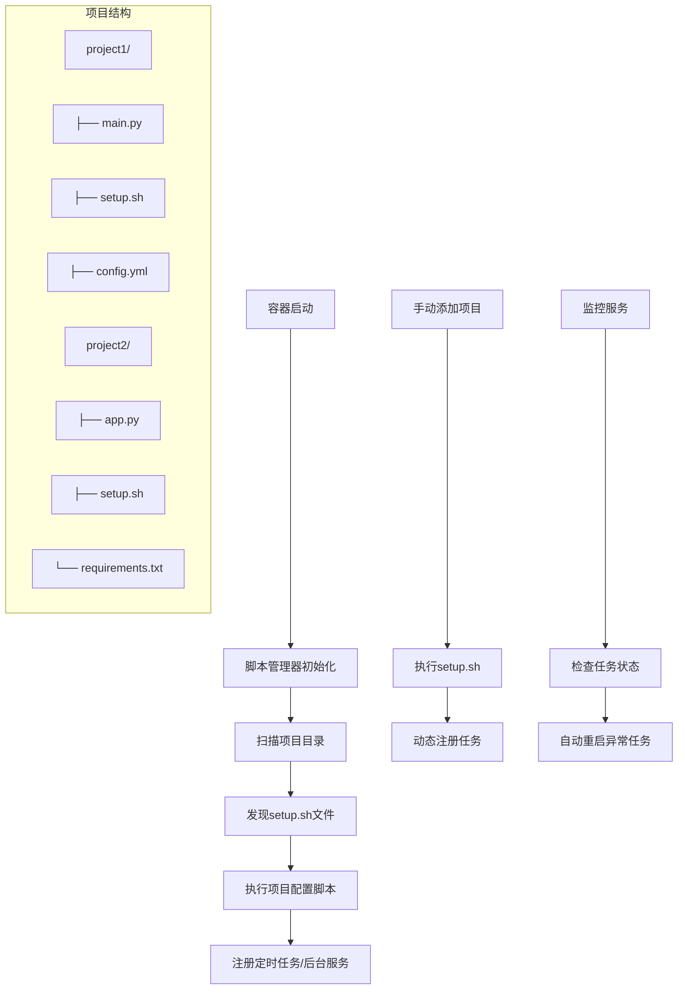
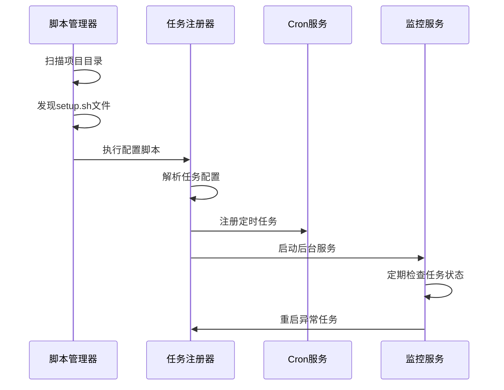
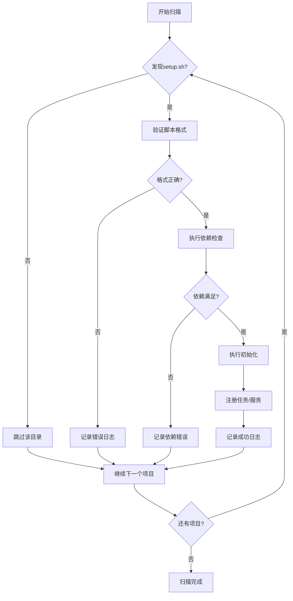
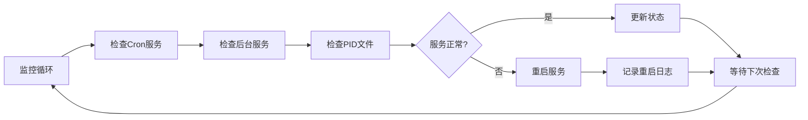
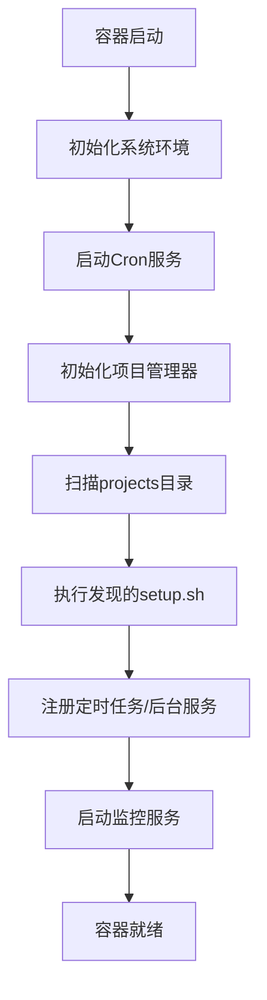
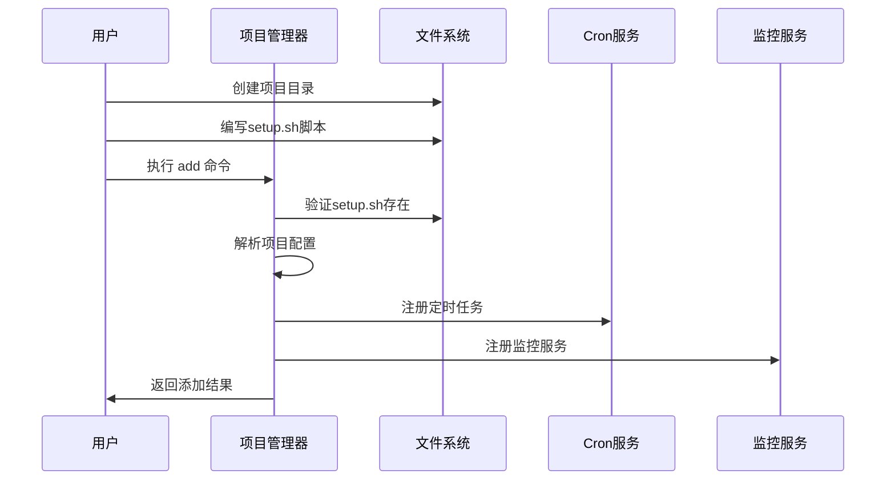
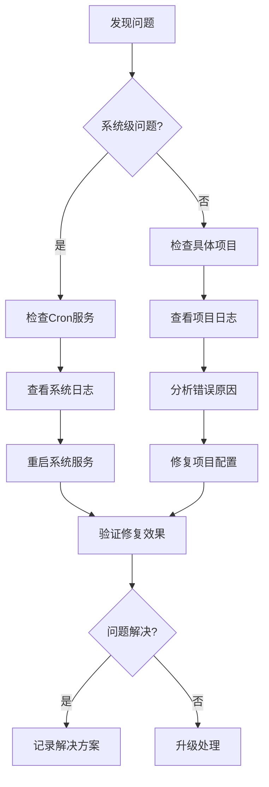

# 自动脚本执行管理器设计文档

## 1. 概述

### 1.1 项目背景
当前的定时任务管理系统需要为每个新任务修改多个配置文件（Dockerfile、docker-compose.yml、entrypoint.sh），管理复杂且容易出错。本设计提供一个自动脚本执行管理器，通过统一的约定和自动发现机制，简化新项目的添加流程。

### 1.2 设计目标
- 统一项目管理：每个项目目录包含统一命名的配置脚本
- 自动发现机制：容器启动时自动扫描并执行项目配置脚本
- 动态管理：支持不重启容器手动添加新项目
- 灵活配置：项目脚本可自定义定时任务或后台服务
- 标准化流程：减少手工配置，降低出错概率

### 1.3 核心价值
- **简化运维**：新项目添加只需创建目录和配置脚本
- **提高效率**：避免重复修改多个配置文件
- **降低错误**：统一的约定减少配置错误
- **动态扩展**：支持运行时添加项目，无需重启容器

## 2. 架构设计

### 2.1 系统架构图



### 2.2 组件架构

| 组件 | 职责 | 接口 |
|------|------|------|
| **脚本管理器** | 发现和执行项目配置脚本 | `scan_projects()`, `execute_setup()` |
| **任务注册器** | 注册定时任务和后台服务 | `register_cron()`, `register_service()` |
| **监控服务** | 监控任务状态和自动恢复 | `check_status()`, `restart_task()` |
| **配置解析器** | 解析项目配置信息 | `parse_config()`, `validate_config()` |

### 2.3 数据流图



## 3. 核心功能设计

### 3.1 项目约定规范

#### 3.1.1 目录结构约定
```
/app/
├── projects/           # 项目根目录
│   ├── project1/      # 项目1
│   │   ├── setup.sh   # 项目配置脚本（必需）
│   │   ├── main.py    # 主执行文件
│   │   └── config.yml # 项目配置文件（可选）
│   ├── project2/      # 项目2
│   │   ├── setup.sh   # 项目配置脚本
│   │   └── app.py     # 应用文件
│   └── project3/      # 项目3
│       ├── setup.sh
│       └── service.py
├── scripts/           # 管理脚本
│   ├── project_manager.sh   # 项目管理器
│   └── task_monitor.sh      # 任务监控器
└── logs/             # 日志目录
    ├── projects/     # 项目日志
    └── system/       # 系统日志
```

#### 3.1.2 setup.sh脚本规范
每个项目的`setup.sh`脚本需要遵循以下规范：

```bash
#!/bin/bash
# 项目名称：必需，用于日志和标识
PROJECT_NAME="project1"

# 项目类型：cron（定时任务）或service（后台服务）
PROJECT_TYPE="cron"

# 定时任务配置（当PROJECT_TYPE=cron时）
CRON_SCHEDULE="0 */2 * * *"
CRON_COMMAND="cd /app/projects/${PROJECT_NAME} && python3 main.py"

# 后台服务配置（当PROJECT_TYPE=service时）
SERVICE_COMMAND="cd /app/projects/${PROJECT_NAME} && python3 service.py"
SERVICE_RESTART_POLICY="always"

# 依赖检查函数（可选）
check_dependencies() {
    # 检查Python包、文件等依赖
    return 0
}

# 初始化函数（可选）
initialize() {
    # 项目初始化逻辑
    echo "初始化 ${PROJECT_NAME}..."
}

# 清理函数（可选）
cleanup() {
    # 项目清理逻辑
    echo "清理 ${PROJECT_NAME}..."
}
```

### 3.2 脚本管理器功能

#### 3.2.1 项目发现机制
```bash
# 扫描项目目录
scan_projects() {
    local projects_dir="/app/projects"
    local discovered_projects=()
    
    for project_dir in "$projects_dir"/*; do
        if [[ -d "$project_dir" && -f "$project_dir/setup.sh" ]]; then
            discovered_projects+=("$(basename "$project_dir")")
        fi
    done
    
    echo "${discovered_projects[@]}"
}
```

#### 3.2.2 脚本执行流程


### 3.3 任务注册器设计

#### 3.3.1 定时任务注册
```bash
register_cron_task() {
    local project_name="$1"
    local schedule="$2"
    local command="$3"
    local log_file="/app/logs/projects/${project_name}.log"
    
    # 添加到crontab
    (crontab -l 2>/dev/null; echo "${schedule} ${command} >> ${log_file} 2>&1") | crontab -
    
    # 记录注册信息
    echo "$(date): 注册定时任务 ${project_name}" >> /app/logs/system/registration.log
}
```

#### 3.3.2 后台服务注册
```bash
register_background_service() {
    local project_name="$1"
    local command="$2"
    local restart_policy="$3"
    local log_file="/app/logs/projects/${project_name}.log"
    local pid_file="/app/logs/projects/${project_name}.pid"
    
    # 启动后台服务
    nohup bash -c "${command}" >> "${log_file}" 2>&1 &
    echo $! > "${pid_file}"
    
    # 添加到监控列表
    echo "${project_name}:${restart_policy}:${command}" >> /app/logs/system/services.conf
}
```

### 3.4 监控服务设计

#### 3.4.1 任务状态监控


#### 3.4.2 自动恢复机制
| 故障类型 | 检测方式 | 恢复策略 |
|----------|----------|----------|
| Cron服务停止 | 进程检查 | 重启Cron服务 |
| 后台服务异常 | PID检查 | 重新启动服务 |
| 日志文件错误 | 文件检查 | 重建日志文件 |
| 资源不足 | 系统监控 | 清理资源后重启 |

## 4. 接口设计

### 4.1 命令行接口

#### 4.1.1 项目管理命令
```bash
# 扫描并注册所有项目
/app/scripts/project_manager.sh scan

# 添加单个项目
/app/scripts/project_manager.sh add <project_name>

# 移除项目
/app/scripts/project_manager.sh remove <project_name>

# 列出所有项目
/app/scripts/project_manager.sh list

# 查看项目状态
/app/scripts/project_manager.sh status <project_name>

# 重启项目
/app/scripts/project_manager.sh restart <project_name>
```

#### 4.1.2 任务监控命令
```bash
# 查看所有任务状态
/app/scripts/task_monitor.sh status

# 查看项目日志
/app/scripts/task_monitor.sh logs <project_name> [lines]

# 手动重启异常任务
/app/scripts/task_monitor.sh restart <project_name>

# 查看系统健康状态
/app/scripts/task_monitor.sh health
```

### 4.2 配置文件接口

#### 4.2.1 全局配置文件
```yaml
# /app/config/global.yml
system:
  scan_interval: 60          # 扫描间隔（秒）
  monitor_interval: 30       # 监控间隔（秒）
  max_restart_attempts: 3    # 最大重启尝试次数
  log_rotation_days: 7       # 日志保留天数

defaults:
  cron_schedule: "0 */1 * * *"    # 默认定时任务调度
  service_restart_policy: "always" # 默认重启策略
  log_level: "INFO"               # 默认日志级别

paths:
  projects_dir: "/app/projects"
  logs_dir: "/app/logs"
  scripts_dir: "/app/scripts"
```

#### 4.2.2 项目配置模板
```yaml
# project_template/config.yml
project:
  name: "template_project"
  description: "项目描述"
  version: "1.0.0"
  author: "作者名称"

execution:
  type: "cron"  # cron 或 service
  schedule: "0 */2 * * *"
  command: "python3 main.py"
  working_directory: "."
  environment:
    PYTHONPATH: "/app/projects/template_project"
    LOG_LEVEL: "INFO"

dependencies:
  python_packages:
    - "requests"
    - "pyyaml"
  system_packages:
    - "curl"
  files:
    - "main.py"
    - "config.yml"

monitoring:
  health_check_url: ""
  max_memory_mb: 512
  max_cpu_percent: 80
  restart_policy: "on-failure"
```

## 5. 实现流程

### 5.1 容器启动流程



### 5.2 项目添加流程



### 5.3 错误处理流程

| 错误场景 | 检测方式 | 处理策略 | 恢复机制 |
|----------|----------|----------|----------|
| setup.sh不存在 | 文件检查 | 跳过该项目 | 记录警告日志 |
| setup.sh语法错误 | 脚本执行 | 终止执行 | 记录错误详情 |
| 依赖检查失败 | 函数返回值 | 跳过注册 | 提示缺失依赖 |
| 任务注册失败 | 返回状态 | 回滚操作 | 清理部分状态 |
| 服务启动失败 | 进程检查 | 重试启动 | 降级为手动模式 |

## 6. 测试策略

### 6.1 单元测试

#### 6.1.1 脚本管理器测试
```bash
# 测试项目发现功能
test_project_discovery() {
    setup_test_projects
    projects=$(scan_projects)
    assert_equals "project1 project2" "$projects"
}

# 测试脚本执行功能
test_script_execution() {
    create_test_setup_script
    result=$(execute_project_setup "test_project")
    assert_success "$result"
}
```

#### 6.1.2 任务注册器测试
```bash
# 测试定时任务注册
test_cron_registration() {
    register_cron_task "test" "* * * * *" "echo test"
    cron_entry=$(crontab -l | grep "echo test")
    assert_not_empty "$cron_entry"
}

# 测试后台服务注册
test_service_registration() {
    register_background_service "test" "sleep 100" "always"
    assert_file_exists "/app/logs/projects/test.pid"
}
```

### 6.2 集成测试

#### 6.2.1 端到端测试场景


#### 6.2.2 性能测试
| 测试项目 | 测试指标 | 预期值 | 测试方法 |
|----------|----------|--------|----------|
| 项目扫描速度 | 扫描100个项目耗时 | <5秒 | 批量创建项目测试 |
| 内存使用 | 监控服务内存占用 | <50MB | 长时间运行监控 |
| 任务延迟 | 定时任务触发延迟 | <1秒 | 精确时间测量 |
| 恢复时间 | 服务异常后恢复时间 | <30秒 | 模拟故障测试 |

## 7. 运维指南

### 7.1 日志管理

#### 7.1.1 日志结构
```
/app/logs/
├── system/                    # 系统日志
│   ├── project_manager.log    # 项目管理日志
│   ├── task_monitor.log       # 任务监控日志
│   ├── registration.log       # 注册操作日志
│   └── error.log             # 错误日志
├── projects/                  # 项目日志
│   ├── project1.log          # 项目1执行日志
│   ├── project1.pid          # 项目1进程ID
│   ├── project2.log          # 项目2执行日志
│   └── project2.pid          # 项目2进程ID
└── archive/                   # 归档日志
    ├── 2024-01/              # 按月归档
    └── 2024-02/
```

#### 7.1.2 日志查看命令
```bash
# 查看系统日志
tail -f /app/logs/system/project_manager.log

# 查看项目日志
tail -f /app/logs/projects/project1.log

# 查看错误日志
grep "ERROR" /app/logs/system/*.log

# 查看最近1小时的日志
find /app/logs -name "*.log" -exec grep "$(date -d '1 hour ago' '+%Y-%m-%d %H')" {} +
```

### 7.2 故障排查

#### 7.2.1 常见问题诊断表
| 问题现象 | 可能原因 | 诊断命令 | 解决方案 |
|----------|----------|----------|----------|
| 项目未被发现 | setup.sh不存在或无执行权限 | `ls -la /app/projects/*/setup.sh` | 检查文件权限和存在性 |
| 定时任务不执行 | Cron服务停止或配置错误 | `service cron status` | 重启Cron服务 |
| 后台服务异常退出 | 脚本错误或资源不足 | `cat /app/logs/projects/*.log` | 检查日志分析原因 |
| 监控服务失效 | 监控脚本异常 | `ps aux \| grep monitor` | 重启监控服务 |

#### 7.2.2 故障排查流程


### 7.3 维护操作

#### 7.3.1 定期维护任务
```bash
# 每日维护脚本
#!/bin/bash
# 清理过期日志
find /app/logs -name "*.log" -mtime +7 -delete

# 检查磁盘使用率
df -h /app | awk 'NR==2 {print $5}' | sed 's/%//' | (
    read usage
    if [ $usage -gt 80 ]; then
        echo "警告：磁盘使用率超过80%"
    fi
)

# 验证所有项目状态
/app/scripts/project_manager.sh list | while read project; do
    status=$(/app/scripts/project_manager.sh status "$project")
    if [[ "$status" != "running" ]]; then
        echo "项目 $project 状态异常：$status"
    fi
done
```

#### 7.3.2 备份策略
| 备份内容 | 备份频率 | 保留时间 | 备份位置 |
|----------|----------|----------|----------|
| 项目配置文件 | 每日 | 30天 | /app/backup/configs/ |
| 系统日志 | 每周 | 90天 | /app/backup/logs/ |
| Crontab配置 | 每次变更 | 永久 | /app/backup/crontab/ |
| 监控配置 | 每次变更 | 永久 | /app/backup/monitoring/ |