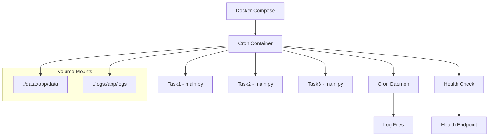
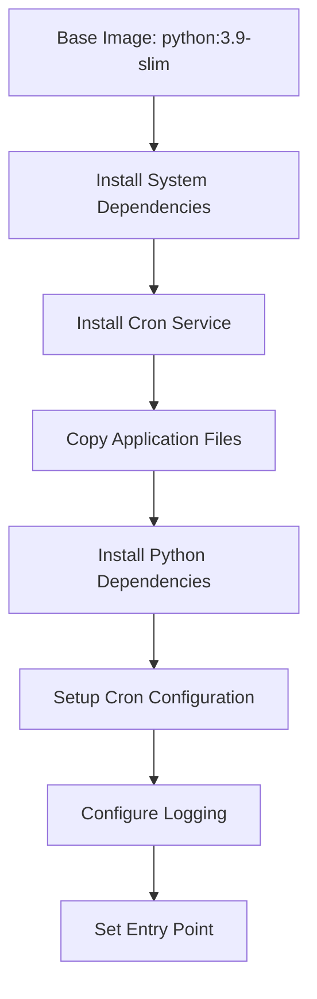
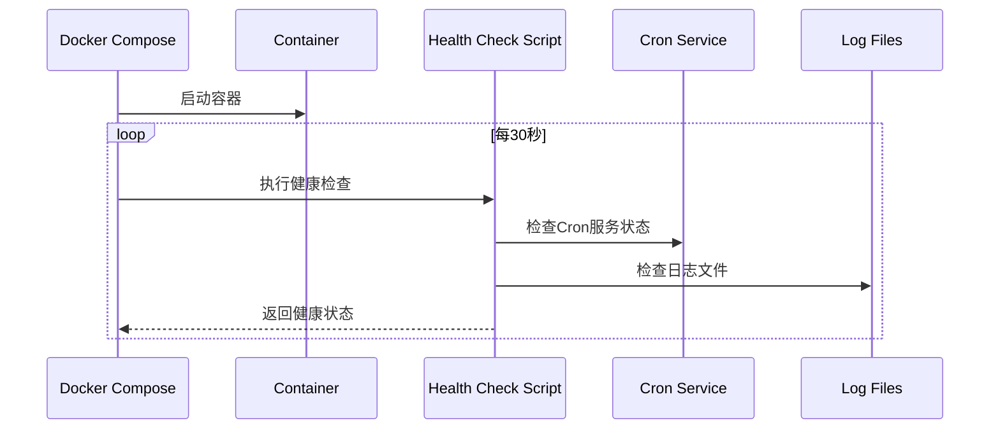
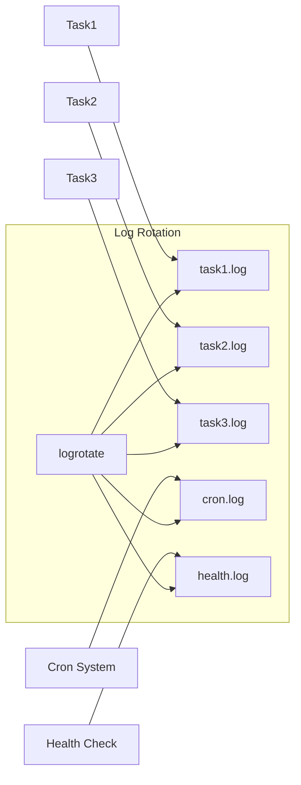
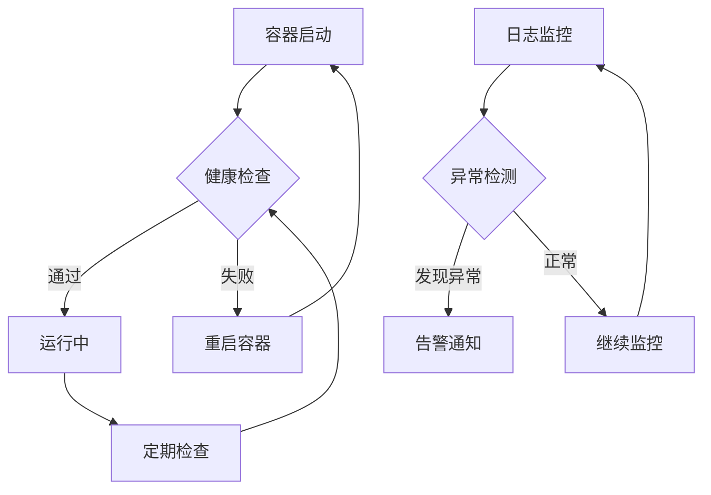
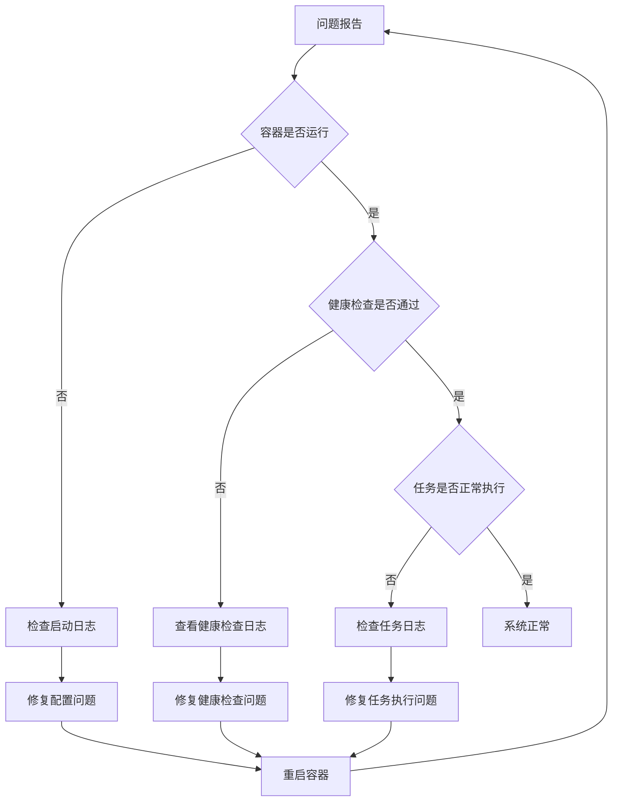

# Docker Compose 定时任务容器化设计

## 1. 概述

本设计旨在为三个独立的Python脚本提供一个基于Docker Compose的定时任务执行环境。系统支持灵活的定时配置、健康检查、日志管理和任务监控功能。

### 核心特性
- 支持多个独立Python脚本的定时执行
- 基于环境变量的灵活配置
- 内置健康检查机制
- 实时日志监控
- 容器化部署，便于管理和扩展

## 2. 技术架构

### 系统组件图



### 架构层次

| 层级 | 组件 | 职责 |
|------|------|------|
| 容器编排层 | Docker Compose | 服务定义、网络配置、卷管理 |
| 任务调度层 | Cron Daemon | 定时任务调度、时间管理 |
| 脚本执行层 | Python Scripts | 业务逻辑执行 |
| 监控层 | Health Check | 服务状态监控、异常检测 |
| 日志层 | Log Management | 日志收集、存储、轮转 |

## 3. 容器设计

### 3.1 Dockerfile 结构



### 3.2 文件结构映射

| 宿主机路径 | 容器内路径 | 用途 |
|------------|------------|------|
| `./task1/` | `/app/task1/` | 任务1脚本 |
| `./task2/` | `/app/task2/` | 任务2脚本 |
| `./task3/` | `/app/task3/` | 任务3脚本 |
| `./data/` | `/app/data/` | 数据持久化 |
| `./logs/` | `/app/logs/` | 日志文件 |

## 4. 定时任务配置

### 4.1 环境变量配置

| 变量名 | 默认值 | 描述 | 示例 |
|--------|--------|------|------|
| `TASK1_SCHEDULE` | `0 */2 * * *` | 任务1执行时间 | 每2小时执行 |
| `TASK2_SCHEDULE` | `*/30 * * * *` | 任务2执行时间 | 每30分钟执行 |
| `TASK3_SCHEDULE` | `0 9 * * 1` | 任务3执行时间 | 每周一9点执行 |
| `TIMEZONE` | `Asia/Shanghai` | 时区设置 | 中国标准时间 |
| `LOG_LEVEL` | `INFO` | 日志级别 | INFO/DEBUG/ERROR |

### 4.2 Cron 表达式示例

```
# 分钟 小时 日期 月份 星期
0 2 * * *      # 每天凌晨2点
*/15 * * * *   # 每15分钟
0 */6 * * *    # 每6小时
0 9 * * 1-5    # 工作日上午9点
0 0 1 * *      # 每月1号午夜
```

## 5. 健康检查机制

### 5.1 健康检查流程



### 5.2 健康检查指标

| 检查项 | 检查方法 | 正常标准 |
|--------|----------|----------|
| Cron服务状态 | `pgrep cron` | 进程存在 |
| 日志文件可写 | 写入测试 | 写入成功 |
| 最近任务执行 | 日志时间戳 | 24小时内有执行记录 |
| 磁盘空间 | `df` 命令 | 可用空间>10% |

## 6. 日志管理

### 6.1 日志架构



### 6.2 日志配置

| 日志类型 | 文件路径 | 轮转策略 | 保留期限 |
|----------|----------|----------|----------|
| 任务1日志 | `/app/logs/task1.log` | 每日轮转 | 保留7天 |
| 任务2日志 | `/app/logs/task2.log` | 每日轮转 | 保留7天 |
| 任务3日志 | `/app/logs/task3.log` | 每日轮转 | 保留7天 |
| 系统日志 | `/app/logs/cron.log` | 每日轮转 | 保留30天 |
| 健康检查 | `/app/logs/health.log` | 每周轮转 | 保留4周 |

## 7. 部署配置

### 7.1 Docker Compose 服务定义

```yaml
version: '3.8'
services:
  cron-scheduler:
    build: .
    container_name: cron-tasks
    environment:
      - TASK1_SCHEDULE=${TASK1_SCHEDULE:-0 */2 * * *}
      - TASK2_SCHEDULE=${TASK2_SCHEDULE:-*/30 * * * *}
      - TASK3_SCHEDULE=${TASK3_SCHEDULE:-0 9 * * 1}
      - TIMEZONE=${TIMEZONE:-Asia/Shanghai}
    volumes:
      - ./data:/app/data
      - ./logs:/app/logs
    restart: unless-stopped
    healthcheck:
      test: ["CMD", "/app/scripts/health_check.sh"]
      interval: 30s
      timeout: 10s
      retries: 3
      start_period: 40s
```

### 7.2 启动脚本

| 脚本名称 | 功能 | 使用方式 |
|----------|------|----------|
| `start.sh` | 一键启动服务 | `./start.sh` |
| `stop.sh` | 停止服务 | `./stop.sh` |
| `restart.sh` | 重启服务 | `./restart.sh` |
| `status.sh` | 查看状态 | `./status.sh` |
| `logs.sh` | 查看日志 | `./logs.sh [task1|task2|task3]` |

## 8. 监控与运维

### 8.1 容器状态监控



### 8.2 运维命令

| 操作 | 命令 | 说明 |
|------|------|------|
| 查看容器状态 | `docker ps` | 检查容器运行状态 |
| 查看容器日志 | `docker logs cron-tasks` | 查看容器系统日志 |
| 进入容器 | `docker exec -it cron-tasks bash` | 进入容器调试 |
| 查看定时任务 | `docker exec cron-tasks crontab -l` | 查看当前定时任务 |
| 重启服务 | `docker-compose restart` | 重启整个服务 |

## 9. 故障排查

### 9.1 常见问题诊断

| 问题症状 | 可能原因 | 解决方案 |
|----------|----------|----------|
| 定时任务不执行 | Cron服务未启动 | 检查并重启Cron服务 |
| 任务执行报错 | Python依赖缺失 | 检查requirements.txt |
| 日志文件空白 | 权限问题 | 检查目录权限设置 |
| 健康检查失败 | 磁盘空间不足 | 清理日志文件 |
| 容器频繁重启 | 配置错误 | 检查环境变量配置 |

### 9.2 调试流程



## 10. 扩展性设计

### 10.1 添加新任务

1. 在项目根目录创建新的任务目录（如`task4/`）
2. 在该目录下放置`main.py`脚本
3. 在`docker-compose.yml`中添加对应的环境变量
4. 重新构建并启动容器

### 10.2 自定义配置

- 支持通过`.env`文件配置环境变量
- 支持自定义Python依赖包
- 支持挂载外部配置文件
- 支持多环境部署（开发/测试/生产）

### 10.3 集成外部系统

| 集成类型 | 实现方式 | 用途 |
|----------|----------|------|
| 消息队列 | RabbitMQ/Redis | 任务结果通知 |
| 监控系统 | Prometheus | 性能指标收集 |
| 日志聚合 | ELK Stack | 集中化日志管理 |
| 配置中心 | Consul/etcd | 动态配置管理 |